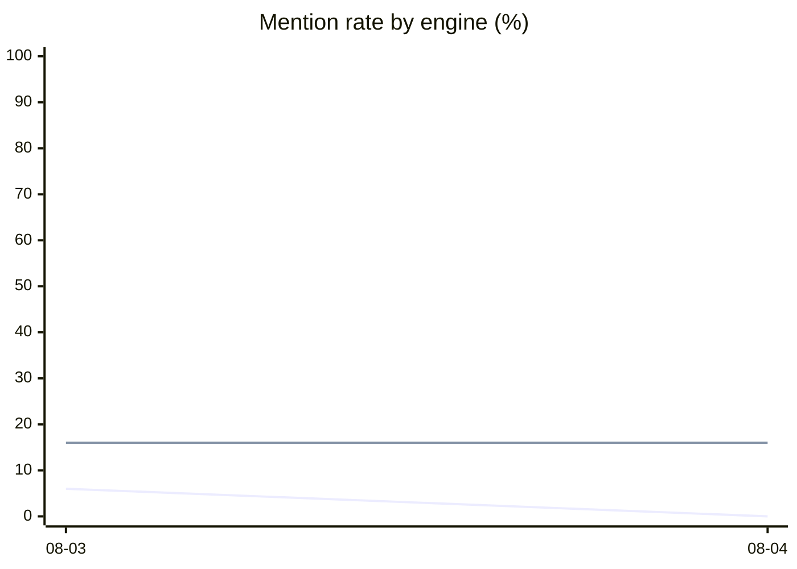

# AI visibility

**2026-08-04** · Claude, ChatGPT · 34 answers scored · run 2

## Do this next

**1. Competitors own 6 pain-shaped questions** `high`

- e.g. "Why does Claude Code change files I didn't ask it to?" — every engine named Claude Code and none named us.
- These are the highest-intent, lowest-competition queries available, and they lose to nobody in particular — they lose to whoever wrote about the problem. Answer them verbatim as headings somewhere crawlable, with an answer that stands alone when quoted.
- *Should move: Tier 1 mention rate*

**2. The engines are reading communities, not vendor sites** `high`

- Top sources this cycle: code.claude.com (10), dev.to (8), github.com (7), morphllm.com (6), arxiv.org (5).
- Presence on dev.to and github.com is worth more than another page on our own site. A well-written answer in a thread the engines already cite is the highest-leverage single action on this list.
- *Should move: Citation rate, and our own domain appearing in this list*

Do the top one, then re-measure. Two changes at once and neither can be attributed.

| | Now | vs last run |
|---|---|---|
| **Mention rate** — named at all | **9%** | -2 pts |
| **Citation rate** — actually linked | **0%** | -3 pts |
| **Share of voice** | **4%** | of 11 tools named |

A mention without a link is not traffic — that is why the two rates are counted separately.

## By engine

| Engine | Asked | Mentioned | Cited | Mention rate | vs last |
|---|---:|---:|---:|---:|---|
| Claude | 15 | 0 | 0 | 0% | -6 pts |
| ChatGPT | 19 | 3 | 0 | 16% | no change |

## Mention rate over time

Series in order: Claude, ChatGPT.

## By tier

| Tier | What it measures | Mentioned | Cited |
|---|---|---:|---:|
| 1 | Pain-shaped | 0/14 | 0/14 |
| 2 | Solution-aware | 0/12 | 0/12 |
| 3 | Category | 0/5 | 0/5 |
| 4 | Brand | 3/3 | 0/3 |

## Competitors

| Tool | Named | Beats us | Alongside | vs last |
|---|---:|---:|---:|---:|
| Claude Code | 17 | **15** | 2 | -2 |
| Cursor | 15 | **14** | 1 | -2 |
| Codex | 12 | **10** | 2 | +6 |
| GitHub Copilot | 10 | **10** | 0 | +2 |
| Windsurf | 5 | **5** | 0 | +4 |
| Aider | 5 | **4** | 1 | 0 |
| Cline | 3 | **3** | 0 | +1 |
| CodeRabbit | 2 | **2** | 0 | 0 |
| Greptile | 2 | **2** | 0 | +1 |
| Continue | 1 | **1** | 0 | 0 |

**Beats us** is the column that matters — answers naming them and not us.

## Who else gets named

| Tool | Times named | Share |
|---|---:|---:|
| Claude Code | 17 | 23% |
| Cursor | 15 | 20% |
| Codex | 12 | 16% |
| GitHub Copilot | 10 | 13% |
| Aider | 5 | 7% |
| Windsurf | 5 | 7% |
| **Super Terminal** | 3 | 4% |
| Cline | 3 | 4% |
| CodeRabbit | 2 | 3% |
| Greptile | 2 | 3% |

## Where the answers come from

| Domain | Times cited |
|---|---:|
| code.claude.com | 10 |
| dev.to | 8 |
| github.com | 7 |
| morphllm.com | 6 |
| arxiv.org | 5 |
| claudefa.st | 4 |
| stevekinney.com | 4 |
| techsy.io | 4 |
| medium.com | 4 |
| augmentcode.com | 4 |
| ai.plainenglish.io | 3 |
| systemprompt.io | 3 |

Community platforms take over half of all AI citations industry-wide. If Reddit and
GitHub are high in this list, that is the expected shape — and it is where the
highest-leverage work is, not on our own pages.

## Every question

◆ cited · ● mentioned · ✕ named but disavowed · – absent · ! error

| Question | Tier | Claude | ChatGPT |
|---|---|---|---|
| Why does Claude Code change files I didn't ask it to? | 1 | – | – |
| How do I stop an AI coding agent from editing unrelated files? | 1 | – | – |
| How do I make Cursor follow the rules in my CLAUDE.md? | 1 | – | – |
| Can I use the same coding rules for Claude Code, Cursor and Codex? | 1 | – | – |
| My AI assistant deleted the wrong element — how do I prevent that? | 1 | – | – |
| How do I undo everything an AI coding agent just did? | 1 | – | – |
| How do I stop an AI agent from doing more than I asked? | 1 | – | – |
| How can I have one AI review another AI's code? | 2 | – | – |
| Is there a tool that checks AI-generated code against my project's rules? | 2 | – | – |
| How do I verify an AI coding agent met the ticket's requirements? | 2 | – | – |
| Can I run the same task through Claude Code and Cursor and compare? | 2 | – | – |
| How do I share coding standards across a team that uses AI agents? | 2 | – | – |
| How do I chain multiple AI coding agents into one workflow? | 2 | – | – |
| What are the best tools for managing multiple AI coding agents? | 3 | – | – |
| Best CLI tools for AI-assisted development | 3 | – | ! |
| Alternatives to using Claude Code on its own | 3 | ! | – |
| How do I make AI coding assistants safer to use on a real codebase? | 3 | ! | – |
| What is Super Terminal, the CLI for AI coding agents? | 4 | ! | ● |
| Is Super Terminal (the AI coding agent CLI) open source? | 4 | ! | ● |
| Does Super Terminal need its own API key? | 4 | ! | ● |

---

**How to read this.** These figures come from each vendor's API with its web-search
tool, which is not the same system as the consumer chat product — different index,
different ranking, no personalisation. Measured identically every cycle, so the
*movement* is real even though the absolute numbers are a proxy.

**One change per cycle.** Two at once and you cannot attribute the result, which
forfeits the only thing that makes this data rather than opinion.

Open `dashboard.html` for the full analytics view. Raw rows in `data/runs/2026-08-04.json`.
